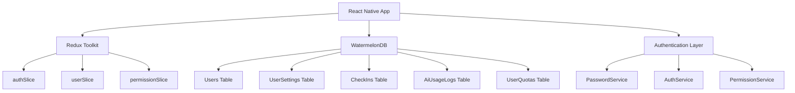
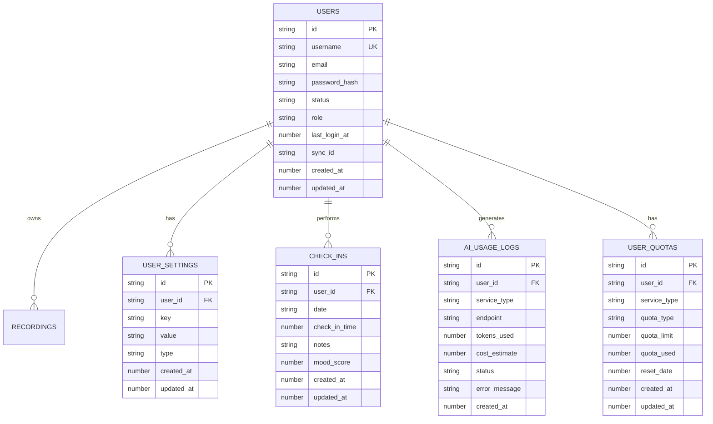
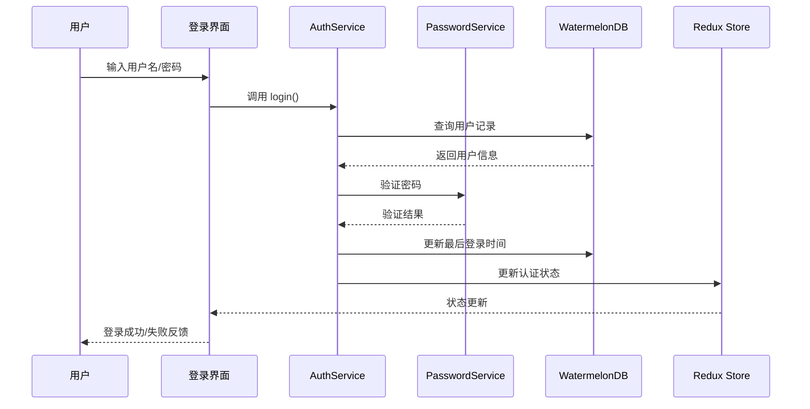
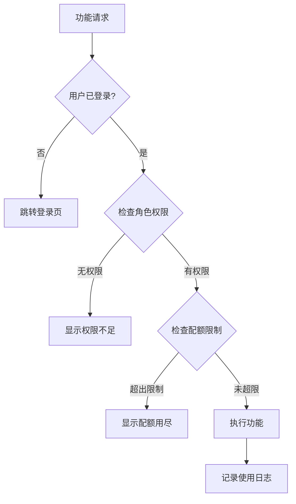
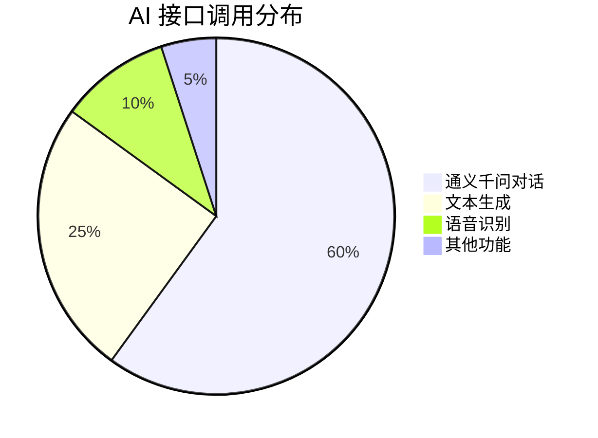
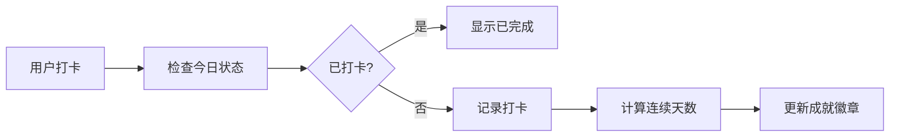

# 用户管理和权限控制系统设计

## 概述

基于 SpellApp 现有架构，设计一个本地优先的用户管理和权限控制系统。该系统支持用户注册、登录、打卡功能以及 AI 接口调用限制，同时为未来云端同步做好准备。

## 技术架构

### 核心设计原则
- **本地优先**：所有数据优先存储在本地 WatermelonDB，减少网络依赖
- **云端兼容**：预留同步字段，便于后续云端集成
- **权限分层**：基于角色的访问控制（RBAC）
- **资源管控**：对 AI 接口进行精细化配额管理

### 技术栈扩展


## 数据模型设计

### 数据库 Schema 扩展

```typescript
export default appSchema({
  version: 2, // 升级到版本 2
  tables: [
    // 现有 recordings 表
    tableSchema({
      name: 'recordings',
      columns: [
        { name: 'title', type: 'string' },
        { name: 'script', type: 'string' },
        { name: 'url', type: 'string' },
        { name: 'duration', type: 'number' },
        { name: 'play_count', type: 'number' },
        { name: 'recording_time', type: 'number' },
        { name: 'user_id', type: 'string' }, // 新增：关联用户
        { name: 'created_at', type: 'number' },
        { name: 'updated_at', type: 'number' },
      ],
    }),
    
    // 用户表
    tableSchema({
      name: 'users',
      columns: [
        { name: 'username', type: 'string' },
        { name: 'email', type: 'string', isOptional: true },
        { name: 'password_hash', type: 'string' },
        { name: 'avatar_url', type: 'string', isOptional: true },
        { name: 'status', type: 'string' }, // active, suspended
        { name: 'role', type: 'string' }, // admin, user, premium
        { name: 'last_login_at', type: 'number', isOptional: true },
        { name: 'sync_id', type: 'string', isOptional: true }, // 云端同步预留
        { name: 'created_at', type: 'number' },
        { name: 'updated_at', type: 'number' },
      ],
    }),
    
    // 用户设置表
    tableSchema({
      name: 'user_settings',
      columns: [
        { name: 'user_id', type: 'string' },
        { name: 'key', type: 'string' },
        { name: 'value', type: 'string' },
        { name: 'type', type: 'string' }, // string, number, boolean, json
        { name: 'created_at', type: 'number' },
        { name: 'updated_at', type: 'number' },
      ],
    }),
    
    // 打卡记录表
    tableSchema({
      name: 'check_ins',
      columns: [
        { name: 'user_id', type: 'string' },
        { name: 'date', type: 'string' }, // YYYY-MM-DD
        { name: 'check_in_time', type: 'number' },
        { name: 'notes', type: 'string', isOptional: true },
        { name: 'mood_score', type: 'number', isOptional: true }, // 1-5 情绪评分
        { name: 'created_at', type: 'number' },
        { name: 'updated_at', type: 'number' },
      ],
    }),
    
    // AI 使用记录表
    tableSchema({
      name: 'ai_usage_logs',
      columns: [
        { name: 'user_id', type: 'string' },
        { name: 'service_type', type: 'string' }, // qwen, openai
        { name: 'endpoint', type: 'string' },
        { name: 'tokens_used', type: 'number' },
        { name: 'cost_estimate', type: 'number' }, // 成本估算（分）
        { name: 'status', type: 'string' }, // success, error, timeout
        { name: 'error_message', type: 'string', isOptional: true },
        { name: 'created_at', type: 'number' },
      ],
    }),
    
    // 用户配额表
    tableSchema({
      name: 'user_quotas',
      columns: [
        { name: 'user_id', type: 'string' },
        { name: 'service_type', type: 'string' },
        { name: 'quota_type', type: 'string' }, // daily, monthly, total
        { name: 'quota_limit', type: 'number' },
        { name: 'quota_used', type: 'number' },
        { name: 'reset_date', type: 'number' },
        { name: 'created_at', type: 'number' },
        { name: 'updated_at', type: 'number' },
      ],
    }),
  ],
});
```

### 实体关系图



## 核心业务功能设计

### 用户认证系统

#### 认证流程设计


#### 密码安全策略
- 使用 bcrypt 进行密码哈希
- 盐值轮数设置为 12
- 支持密码强度检查
- 实现登录失败锁定机制

### 权限控制系统

#### 角色权限矩阵
| 功能模块 | Guest | User | Premium | Admin |
|----------|--------|------|---------|-------|
| 基础录音功能 | ❌ | ✅ | ✅ | ✅ |
| AI 对话功能 | ❌ | 限制 | 增强 | 无限制 |
| 数据导出 | ❌ | ❌ | ✅ | ✅ |
| 用户管理 | ❌ | ❌ | ❌ | ✅ |
| 系统设置 | ❌ | ❌ | ❌ | ✅ |

#### 权限检查流程


### AI 配额管理系统

#### 配额计算逻辑
```typescript
interface QuotaConfig {
  daily: {
    user: 50,      // 普通用户每日 50 次
    premium: 200,  // 高级用户每日 200 次
    admin: -1      // 管理员无限制
  },
  monthly: {
    user: 1000,
    premium: 5000,
    admin: -1
  }
}
```

#### 使用统计分析


### 打卡系统设计

#### 打卡数据结构
```typescript
interface CheckInData {
  userId: string;
  date: string;        // YYYY-MM-DD
  checkInTime: number; // Unix 时间戳
  notes?: string;      // 用户备注
  moodScore?: number;  // 1-5 情绪评分
}
```

#### 连续打卡统计


## 技术实现规划

### 阶段一：数据层构建
- 数据库 Schema 升级迁移
- 创建 Model 类（User, UserSetting, CheckIn, AiUsageLog, UserQuota）
- 实现 Repository 类封装数据访问逻辑

### 阶段二：服务层开发
- 密码加密服务（PasswordService）
- 用户认证服务（AuthService）
- 权限检查服务（PermissionService）
- AI 配额管理服务（QuotaService）

### 阶段三：状态管理集成
- Redux Slice 扩展（authSlice, userSlice）
- 自定义 Hooks（useAuth, useUser, usePermissions）
- 认证状态持久化

### 阶段四：UI 组件开发
- 登录/注册表单组件
- 权限保护路由组件
- 用户资料管理界面
- 配额使用统计界面

### 阶段五：业务功能完善
- 打卡功能实现
- AI 调用拦截器
- 数据统计分析
- 导入导出功能

## 安全考虑

### 数据安全策略
- 敏感数据本地加密存储
- API 调用添加签名验证
- 用户会话超时管理
- 审计日志记录

### 隐私保护机制
- 数据最小化原则
- 用户数据匿名化选项
- 本地数据清除功能
- 隐私设置界面

这个设计既满足了你当前本地优先的需求，又为未来的云端同步做好了充分准备。通过模块化的架构设计，可以分阶段逐步实施，确保系统的稳定性和可维护性。
基于 SpellApp 现有架构，设计一个本地优先的用户管理和权限控制系统。该系统支持用户注册、登录、打卡功能以及 AI 接口调用限制，同时为未来云端同步做好准备。

## 技术架构

### 核心设计原则
- **本地优先**：所有数据优先存储在本地 WatermelonDB，减少网络依赖
- **云端兼容**：预留同步字段，便于后续云端集成
- **权限分层**：基于角色的访问控制（RBAC）
- **资源管控**：对 AI 接口进行精细化配额管理

### 技术栈扩展


## 数据模型设计

### 数据库 Schema 扩展

```typescript
export default appSchema({
  version: 2, // 升级到版本 2
  tables: [
    // 现有 recordings 表
    tableSchema({
      name: 'recordings',
      columns: [
        { name: 'title', type: 'string' },
        { name: 'script', type: 'string' },
        { name: 'url', type: 'string' },
        { name: 'duration', type: 'number' },
        { name: 'play_count', type: 'number' },
        { name: 'recording_time', type: 'number' },
        { name: 'user_id', type: 'string' }, // 新增：关联用户
        { name: 'created_at', type: 'number' },
        { name: 'updated_at', type: 'number' },
      ],
    }),
    
    // 用户表
    tableSchema({
      name: 'users',
      columns: [
        { name: 'username', type: 'string' },
        { name: 'email', type: 'string', isOptional: true },
        { name: 'password_hash', type: 'string' },
        { name: 'avatar_url', type: 'string', isOptional: true },
        { name: 'status', type: 'string' }, // active, suspended
        { name: 'role', type: 'string' }, // admin, user, premium
        { name: 'last_login_at', type: 'number', isOptional: true },
        { name: 'sync_id', type: 'string', isOptional: true }, // 云端同步预留
        { name: 'created_at', type: 'number' },
        { name: 'updated_at', type: 'number' },
      ],
    }),
    
    // 用户设置表
    tableSchema({
      name: 'user_settings',
      columns: [
        { name: 'user_id', type: 'string' },
        { name: 'key', type: 'string' },
        { name: 'value', type: 'string' },
        { name: 'type', type: 'string' }, // string, number, boolean, json
        { name: 'created_at', type: 'number' },
        { name: 'updated_at', type: 'number' },
      ],
    }),
    
    // 打卡记录表
    tableSchema({
      name: 'check_ins',
      columns: [
        { name: 'user_id', type: 'string' },
        { name: 'date', type: 'string' }, // YYYY-MM-DD
        { name: 'check_in_time', type: 'number' },
        { name: 'notes', type: 'string', isOptional: true },
        { name: 'mood_score', type: 'number', isOptional: true }, // 1-5 情绪评分
        { name: 'created_at', type: 'number' },
        { name: 'updated_at', type: 'number' },
      ],
    }),
    
    // AI 使用记录表
    tableSchema({
      name: 'ai_usage_logs',
      columns: [
        { name: 'user_id', type: 'string' },
        { name: 'service_type', type: 'string' }, // qwen, openai
        { name: 'endpoint', type: 'string' },
        { name: 'tokens_used', type: 'number' },
        { name: 'cost_estimate', type: 'number' }, // 成本估算（分）
        { name: 'status', type: 'string' }, // success, error, timeout
        { name: 'error_message', type: 'string', isOptional: true },
        { name: 'created_at', type: 'number' },
      ],
    }),
    
    // 用户配额表
    tableSchema({
      name: 'user_quotas',
      columns: [
        { name: 'user_id', type: 'string' },
        { name: 'service_type', type: 'string' },
        { name: 'quota_type', type: 'string' }, // daily, monthly, total
        { name: 'quota_limit', type: 'number' },
        { name: 'quota_used', type: 'number' },
        { name: 'reset_date', type: 'number' },
        { name: 'created_at', type: 'number' },
        { name: 'updated_at', type: 'number' },
      ],
    }),
  ],
});
```

### 实体关系图


## 核心业务功能设计

### 用户认证系统

#### 认证流程设计


#### 密码安全策略
- 使用 bcrypt 进行密码哈希
- 盐值轮数设置为 12
- 支持密码强度检查
- 实现登录失败锁定机制

### 权限控制系统

#### 角色权限矩阵
| 功能模块 | Guest | User | Premium | Admin |
|----------|--------|------|---------|-------|
| 基础录音功能 | ❌ | ✅ | ✅ | ✅ |
| AI 对话功能 | ❌ | 限制 | 增强 | 无限制 |
| 数据导出 | ❌ | ❌ | ✅ | ✅ |
| 用户管理 | ❌ | ❌ | ❌ | ✅ |
| 系统设置 | ❌ | ❌ | ❌ | ✅ |

#### 权限检查流程


### AI 配额管理系统

#### 配额计算逻辑
```typescript
interface QuotaConfig {
  daily: {
    user: 50,      // 普通用户每日 50 次
    premium: 200,  // 高级用户每日 200 次
    admin: -1      // 管理员无限制
  },
  monthly: {
    user: 1000,
    premium: 5000,
    admin: -1
  }
}
```

#### 使用统计分析


### 打卡系统设计

#### 打卡数据结构
```typescript
interface CheckInData {
  userId: string;
  date: string;        // YYYY-MM-DD
  checkInTime: number; // Unix 时间戳
  notes?: string;      // 用户备注
  moodScore?: number;  // 1-5 情绪评分
}
```

#### 连续打卡统计


## 技术实现规划

### 阶段一：数据层构建
- 数据库 Schema 升级迁移
- 创建 Model 类（User, UserSetting, CheckIn, AiUsageLog, UserQuota）
- 实现 Repository 类封装数据访问逻辑

### 阶段二：服务层开发
- 密码加密服务（PasswordService）
- 用户认证服务（AuthService）
- 权限检查服务（PermissionService）
- AI 配额管理服务（QuotaService）

### 阶段三：状态管理集成
- Redux Slice 扩展（authSlice, userSlice）
- 自定义 Hooks（useAuth, useUser, usePermissions）
- 认证状态持久化

### 阶段四：UI 组件开发
- 登录/注册表单组件
- 权限保护路由组件
- 用户资料管理界面
- 配额使用统计界面

### 阶段五：业务功能完善
- 打卡功能实现
- AI 调用拦截器
- 数据统计分析
- 导入导出功能

## 安全考虑

### 数据安全策略
- 敏感数据本地加密存储
- API 调用添加签名验证
- 用户会话超时管理
- 审计日志记录

### 隐私保护机制
- 数据最小化原则
- 用户数据匿名化选项
- 本地数据清除功能
- 隐私设置界面

这个设计既满足了你当前本地优先的需求，又为未来的云端同步做好了充分准备。通过模块化的架构设计，可以分阶段逐步实施，确保系统的稳定性和可维护性。


