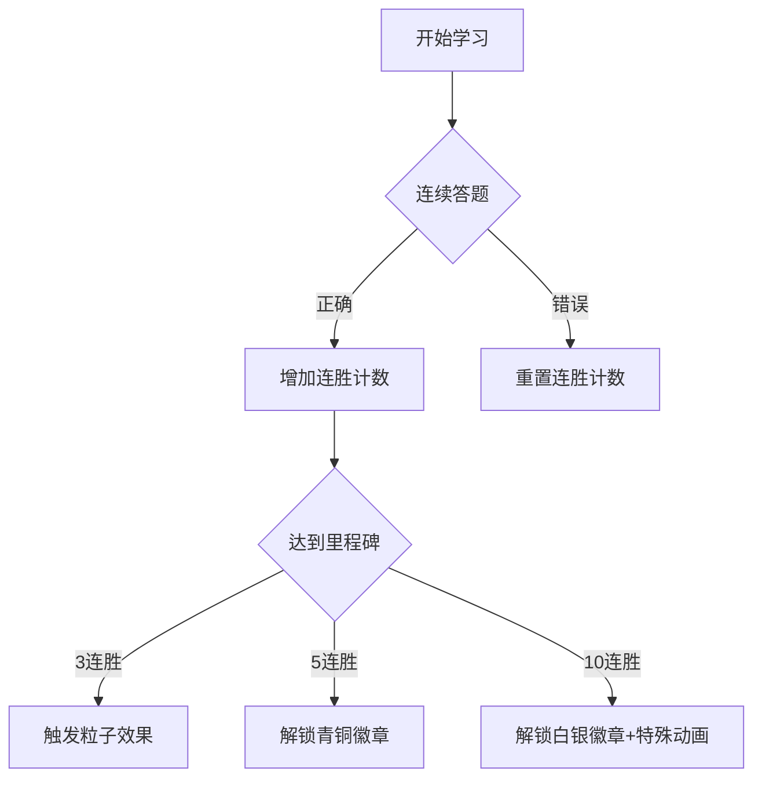

# 学习类软件 UI 设计规范文档

## 1. 设计哲学：Playful Utility（趣味可用主义）
### 核心理念
- **趣味性与实用性平衡**：在保证功能性的前提下，通过游戏化元素增强学习体验
- **认知舒适度**：通过视觉舒适度和交互流畅性降低学习压力
- **沉浸式体验**：创造专注的学习环境，减少干扰因素

### 核心原则
| 原则 | 实现方式 | 应用场景 |
|------|----------|----------|
| 游戏感 | 微动画、徽章系统、进度可视化 | 答题反馈、成就解锁 |
| 安全感 | 大留白、柔圆角、低饱和度 | 内容展示、阅读界面 |
| 操控感 | 拇指热区优化、手势反馈 | 底部导航、卡片交互 |

## 2. 字体系统规范
### 字体选择
| 内容类型 | 西文字体 | 中文字体 | 使用场景 |
|----------|----------|----------|----------|
| 标题/数字 | Poppins Bold | 思源黑体 Heavy | 页面标题、数据指标 |
| 正文 | Inter Regular | 思源黑体 Regular | 课程内容、说明文本 |
| 代码/公式 | JetBrains Mono Medium | - | 编程练习、数学公式 |

### 排版规则
| 元素类型 | 字号 (px) | 行高 (px) | 段间距 (px) | 应用示例 |
|----------|-----------|-----------|-------------|----------|
| 超大 | 32 | 40 | 24 | 成就弹窗标题 |
| 大 | 24 | 32 | 18 | 章节标题 |
| 中 | 17 | 24 | 12.75 | 卡片正文 |
| 小 | 14 | 20 | 10.5 | 辅助说明 |
| 极小 | 12 | 16 | 9 | 标签、标注 |

**排版公式**：
- 行高 = 字号 × 1.25
- 段间距 = 字号 × 0.75

## 3. 颜色系统规范
### 核心色板
| 颜色类型 | 色值 | 使用场景 | WCAG对比度 |
|----------|------|----------|------------|
| **主色** |  |  |  |
| Lime 500 | #A3E635 | 主要按钮、进度指示 | 4.6:1 (on white) |
| Lime 300 | #D9F99D | 悬停状态、次要元素 | 1.8:1 (on white) |
| **中性色** |  |  |  |
| Ink 900 | #111827 | 标题文字、深色背景 | 17.3:1 (on white) |
| Ink 600 | #4B5563 | 正文文字 | 7.3:1 (on white) |
| Ink 200 | #E5E7EB | 分隔线、禁用状态 | 1.3:1 (on white) |
| White | #FFFFFF | 背景、卡片 | - |
| **功能色** |  |  |  |
| Sky 500 | #0EA5E9 | 链接、信息提示 | 3.9:1 (on white) |
| Rose 500 | #F43F5E | 错误提示、重要警告 | 4.5:1 (on white) |
| Amber 400 | #FBBF24 | 警告提示、强调内容 | 2.1:1 (on white) |

### 语义渐变
| 渐变类型 | 颜色组合 | 使用场景 | 动画效果 |
|----------|----------|----------|----------|
| 完成100% | Lime 500 → Sky 400 | 进度完成 | 平滑填充 |
| 连胜火焰 | Rose 500 → Amber 400 | 连续成就 | 粒子动画 |

## 4. 形状与阴影系统
### 圆角规范
| 元素类型 | 圆角半径 (px) | 示例 |
|----------|---------------|------|
| 卡片 | 16 | 课程卡片、内容区块 |
| 按钮 | 12 | 主要按钮、操作按钮 |
| 头像 | 50% | 用户头像、教师头像 |
| 微提示 | 8 | 工具提示、徽章 |

### 阴影规范
| 元素类型 | 阴影参数 | 效果 |
|----------|----------|------|
| 卡片 | Y:4, B:20, #00000008 | 轻量层次感 |
| 悬浮按钮 | Y:6, B:24, #00000010 | 突出可操作性 |
| 模态框 | Y:8, B:32, #00000012 | 深度聚焦效果 |

## 5. 布局与栅格系统
### 响应式栅格
```plaintext
┌───────────────────────┐
│       边距 20px       │
├───┬───┬───┬───┬───┬───┤
│   │   │   │   │   │   │ ← 12栏布局
├───┴───┴───┴───┴───┴───┤
│       槽宽 16px       │
└───────────────────────┘
```

### 布局规则
1. **内容宽度**：屏幕宽度 - (边距×2)
2. **卡片内边距**：内容区再缩进20px
3. **拇指安全区**：底部88px高度为操作热区（含Home Indicator）
4. **组件间距**：垂直间距使用8px倍数（8,16,24,32）

## 6. 背景系统
### 默认背景
```less
.background-default {
  background: linear-gradient(180deg, #FFFFFF 0%, #F9FAFB 100%);
}
```

### 深色模式
```less
.background-dark {
  background: linear-gradient(180deg, #111827 0%, #1F2937 100%);
}
```

### 粒子背景规范
| 参数 | 值 | 说明 |
|------|----|------|
| 粒子数量 | 15 | 随机分布 |
| 粒子尺寸 | 2px | 圆形 |
| 粒子颜色 | Lime 500 (#A3E635) | 主色系 |
| 不透明度 | 6% | 半透明效果 |
| 动画 | 随机漂浮 | 速度0.5-2px/s |

## 7. 核心组件规范
### 主按钮
```figma
尺寸: 高度56px, 最小宽度240px
样式: 圆角12px, 背景Lime 500
文字: Poppins Bold 17px, 颜色White
状态: 
  - 默认: 背景#A3E635 
  - 悬停: 背景#94D832 + 缩放102%
  - 按下: 背景#85CA30 + 缩放98%
反馈: 轻触Haptic震动
```

### 输入框
```figma
尺寸: 高度48px
样式: 
  - 默认: 圆角8px, 边框1px Ink 200
  - 聚焦: 边框2px Sky 500
内边距: 16px
占位符: Inter Regular 17px, 颜色Ink 600
```

### 进度环
```figma
直径: 120px
线宽: 12px
中心显示: 
  - 百分比: Poppins Bold 24px
  - 描述: Inter Regular 14px
动画: 
  - 进度填充: cubic-bezier(0.4,0,0.2,1) 600ms
  - 完成效果: 粒子爆发动画
```

### 成就徽章
```figma
尺寸: 64×64px
结构:
  - 外环: 直径64px, 线宽4px
  - 图标: 48×48px
动画:
  - 脉冲: 0.8s间隔, 缩放105%→100%
  - 解锁: 360度旋转 + 缩放弹跳
```

## 8. 交互手势规范
### 核心手势
| 手势 | 功能 | 视觉反馈 |
|------|------|----------|
| 单指上滑 | 内容滚动/刷新 | 弹性滚动+微阴影 |
| 双指捏合 | 内容缩放 | 平滑缩放过渡 |
| 长按卡片 | 显示更多选项 | 半透明白色覆盖层 |
| 摇一摇 | 触发彩蛋 | 设备震动+粒子效果 |

### 拇指热区设计
```plaintext
┌───────────────────────┐
│                       │
│                       │
│                       │
│                       │
│                       │
├───────────────────────┤ ← 安全区上边界
│                       │
│   主要操作区域         │ ← 高度200px
│                       │
└───────────────────────┘
```

## 9. 动画规范
### 运动曲线
```javascript
const animationCurve = cubic-bezier(0.4, 0, 0.2, 1);
```

### 时长规范
| 动画类型 | 时长 (ms) | 应用场景 |
|----------|-----------|----------|
| 微交互 | 200-300 | 按钮反馈、状态切换 |
| 过渡动画 | 300-500 | 页面切换、模块展开 |
| 成就动画 | 600-1000 | 徽章解锁、进度完成 |
| 彩蛋动画 | 1000+ | 特殊奖励、节日效果 |

## 10. 无障碍设计
### 核心原则
1. **对比度保证**：所有文本与背景最小4.5:1对比度
2. **字号缩放**：支持系统字号放大至200%不破环布局
3. **焦点管理**：键盘导航时有清晰焦点指示
4. **替代文本**：所有图标提供语音描述

### 实现方案
```jsx
<Button 
  accessibilityLabel="提交答案"
  accessibilityHint="双击提交当前练习答案"
  accessibilityRole="button"
>
  <Text style={{ fontSize: 17 }}>提交</Text>
</Button>
```

## 11. 趣味化设计
### 成就系统


### 时间彩蛋
| 时间 | 特效 | 说明 |
|------|------|------|
| 早晨6-8点 | 晨光粒子 | 金色粒子缓慢漂浮 |
| 晚上8-10点 | 星空背景 | 深蓝背景+星星粒子 |
| 用户生日 | 庆祝动画 | 彩带+生日徽章 |
| 节日 | 主题皮肤 | 春节/圣诞等主题色 |

## 12. 设计资源
### 推荐工具
1. **Figma组件库**：[学习类UI套件模板](https://figma.com/@learnui)
2. **颜色生成**：[Huemint配色工具](https://huemint.com)
3. **动画原型**：[ProtoPie交互工具](https://protopie.io)

### 实施建议
1. 创建全局样式变量表（CSS变量或Design Token）
2. 使用原子化设计系统（Atomic Design）构建组件
3. 为每个组件编写交互状态文档
4. 定期进行无障碍测试（WCAG 2.1 AA标准）

> 本规范适用于移动端学习类应用，可根据具体产品需求灵活调整参数，但应保持核心设计哲学的一致性。